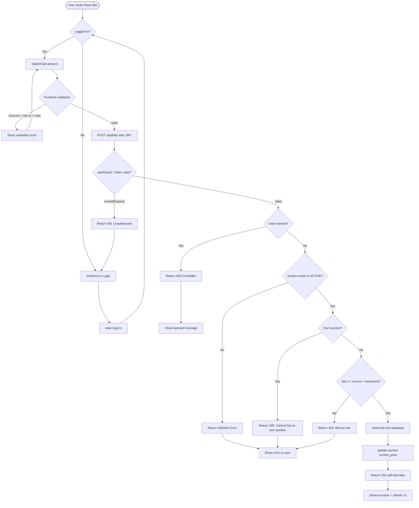
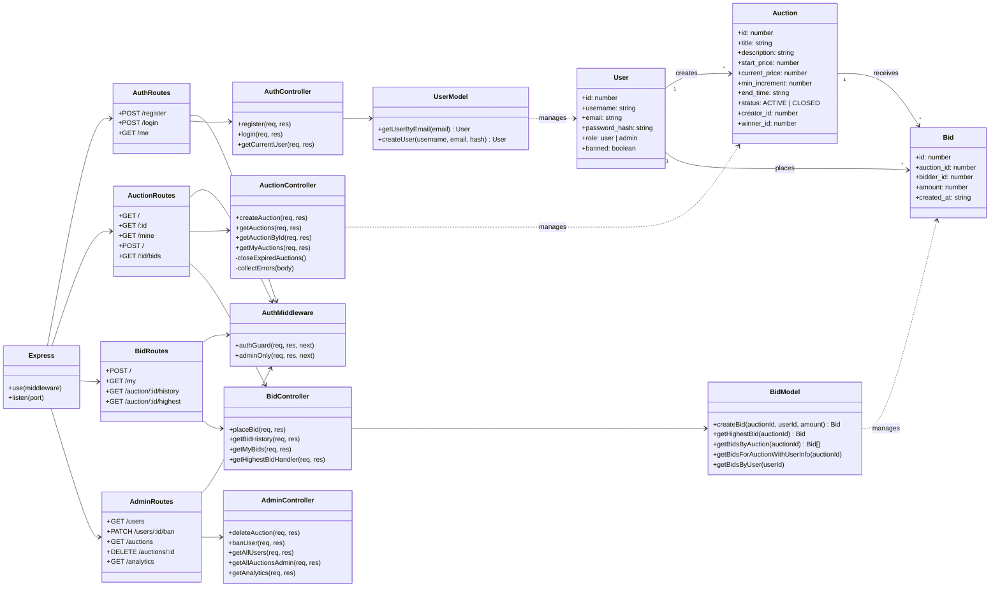

# BidMaster — Real-Time Auction Platform

BidMaster is a full-stack web application where users can create auctions, browse live listings, place bids in real time, and track their activity. An admin panel provides user management, auction moderation, and platform analytics.

## Table of Contents

- [Tech Stack](#tech-stack)
- [Architecture Overview](#architecture-overview)
- [Project Structure](#project-structure)
- [API Endpoints](#api-endpoints)
- [Features](#features)
- [Getting Started](#getting-started)
- [Environment Variables](#environment-variables)
- [Docker](#docker)
- [CI/CD](#cicd)
- [Въпроси за проверка на разбиране](#въпроси-за-проверка-на-разбиране)
- [UML Diagrams](#uml-diagrams)

## Tech Stack

|      Layer       |                   Technology                        |
|------------------|-----------------------------------------------------|
|     Frontend     |    React 18, TypeScript, Vite, React Router v6      |
|     Backend      |           Node.js, Express 5, TypeScript            |
|     Database     | PostgreSQL (Supabase-hosted), accessed via REST API |
|      Auth        | JWT (jsonwebtoken), bcryptjs for password hashing   |
| Containerization |            Docker, Docker Compose                   |
|      CI/CD       |                GitHub Actions                       |

## Architecture Overview

The application follows a layered architecture with clear separation of concerns:

```
Browser ──► React SPA (port 5173) ──► Express API (port 3000) ──► Supabase PostgreSQL
```

- **Frontend**: Single-page application built with React and TypeScript. Uses `AuthContext` for JWT-based session management with automatic token refresh. Pages communicate with the backend through service modules (`authService`, `auctionService`, `bidService`).
- **Backend**: RESTful API built with Express and TypeScript. Organized into routes → controllers → models. Authentication is handled via JWT middleware (`authGuard`), with an additional `adminOnly` middleware for admin routes. All database operations go through the Supabase REST API via Axios.
- **Database**: PostgreSQL hosted on Supabase with three core tables — `users`, `auctions`, and `bids` — connected by foreign keys.

## Project Structure

```
├── .github/workflows/
│   └── ci-cd.yml              # GitHub Actions pipeline
├── backend/
│   ├── Dockerfile
│   ├── package.json
│   └── src/
│       ├── index.ts           # Express app entry point
│       ├── db.ts              # Database connection config
│       ├── middleware/
│       │   └── authMiddleware.ts   # JWT auth guard & admin check
│       ├── models/
│       │   ├── userModel.ts   # User CRUD via Supabase REST
│       │   └── bidModel.ts    # Bid CRUD via Supabase REST
│       ├── controllers/
│       │   ├── authController.ts     # register, login, getCurrentUser
│       │   ├── auctionController.ts  # CRUD auctions, auto-close expired
│       │   ├── bidController.ts      # place bid, history, my bids
│       │   └── adminController.ts    # ban users, delete auctions, analytics
│       └── routes/
│           ├── authRoutes.ts
│           ├── auctionRoutes.ts
│           ├── bidRoutes.ts
│           └── adminRoutes.ts
├── frontend/
│   ├── Dockerfile
│   ├── package.json
│   └── src/
│       ├── main.tsx           # React Router configuration
│       ├── context/
│       │   └── AuthContext.tsx # JWT state, auto-refresh, ban detection
│       ├── services/
│       │   ├── authService.ts
│       │   ├── auctionService.ts
│       │   └── bidService.ts
│       ├── components/
│       │   ├── AuctionCard.tsx
│       │   ├── BidForm.tsx
│       │   └── BidHistory.tsx
│       └── pages/
│           ├── Home.tsx / Home.css
│           ├── Login.tsx / Register.tsx
│           ├── CreateAuction.tsx
│           ├── AuctionDetailPage.tsx
│           ├── MyAuctions.tsx
│           └── MyBids.tsx
├── docker-compose.yml
└── .env
```

## API Endpoints

### Authentication (`/api/auth`)

| Method |     Path    | Auth |              Description                 |
|--------|-------------|------|------------------------------------------|
|  POST  | `/register` |  No  |       Create a new user account          |
|  POST  |   `/login`  |  No  |      Authenticate and receive JWT        |
|  GET   |    `/me`    |  Yes | Get current user profile & refresh token |

### Auctions (`/api/auctions`)

| Method | Path        | Auth |                  Description                       |
|--------|-------------|------|----------------------------------------------------|
|  GET   |     `/`     |  No  | List auctions (filter by `?status=ACTIVE\|CLOSED`) |
|  GET   |   `/:id`    |  No  |           Get a single auction by ID               |
|  GET   |   `/mine`   |  Yes |      Get auctions created by the current user      |
|  POST  |     `/`     |  Yes |               Create a new auction                 |
|  GET   | `/:id/bids` |  No  |         Get bid history for an auction             |

### Bids (`/api/bids`)

| Method |          Path          | Auth |                Description                   |
|--------|------------------------|------|----------------------------------------------|
|  POST  |          `/`           |  Yes |         Place a bid on an auction            |
|  GET   |         `/my`          |  Yes | Get all auctions the current user has bid on |
|  GET   | `/auction/:id/history` |  No  |       Get bid history with usernames         |
|  GET   | `/auction/:id/highest` |  No  |     Get the highest bid for an auction       |

### Admin (`/api/admin`)

| Method |       Path       |   Auth   |          Description           |
|--------|------------------|----------|--------------------------------|
|  GET   | `/users`         |   Admin  |        List all users          |
| PATCH  | `/users/:id/ban` |   Admin  |      Ban or unban a user       |
|  GET   | `/auctions`      |   Admin  | List all auctions (admin view) |
| DELETE | `/auctions/:id`  |   Admin  |       Delete an auction        |
|  GET   | `/analytics`     |   Admin  |    Platform-wide analytics     |

## Features

- **User Authentication** — Register, login, JWT-based sessions with auto-refresh every 30 seconds and on window focus
- **Auction Management** — Create auctions with title, description, start price, minimum increment, and end time
- **Real-Time Bidding** — Place bids with live countdown timers, automatic validation of minimum increment and max amount cap (99,999,999.99)
- **Auto-Close** — Expired auctions are automatically closed on every fetch, with the highest bidder set as winner
- **My Auctions** — Dedicated page to view and filter auctions you created (All / Active / Closed)
- **My Bids** — Dedicated page to track auctions you've bid on with Winning/Outbid/Won/Lost status badges
- **Admin Panel** — User management (ban/unban), auction moderation (delete), and analytics dashboard
- **Ban System** — Banned users are blocked from creating auctions and placing bids, with real-time session detection
- **Responsive Design** — Dark glassmorphism theme with mobile-responsive layouts

## Getting Started

### Prerequisites

- Node.js 18+
- npm
- Docker & Docker Compose (optional, for containerized setup)

### Local Development

1. **Clone the repository**
   ```bash
   git clone https://github.com/your-username/Hukulberi-Fin-Auction-App.git
   cd Hukulberi-Fin-Auction-App
   ```

2. **Set up environment variables** — Create a `.env` file in the project root (see [Environment Variables](#environment-variables))

3. **Start the backend**
   ```bash
   cd backend
   npm install
   npm run dev
   ```

4. **Start the frontend**
   ```bash
   cd frontend
   npm install
   npm run dev
   ```

5. Open `http://localhost:5173` in your browser.

## Environment Variables

Create a `.env` file in the project root:

```env
PORT=3000
JWT_SECRET=your_jwt_secret_key
SUPABASE_URL=https://your-project.supabase.co
SUPABASE_ANON_KEY=your_supabase_anon_key
```

## Docker

The project uses Docker images published to Docker Hub.

```bash
docker compose pull
docker compose up
```

This starts:
- **bidmaster-api** on port 3000
- **bidmaster-frontend** on port 5173

To build locally instead:
```bash
docker build -t bidmaster-backend ./backend
docker build -t bidmaster-frontend ./frontend
```

## CI/CD

The GitHub Actions pipeline (`.github/workflows/ci-cd.yml`) runs on every push and pull request:

1. **Build & Test** — Installs dependencies, builds both backend and frontend, runs security audits
2. **Docker** — On pushes to `main` or `develop`, builds Docker images and pushes them to Docker Hub

## Въпроси за проверка на разбиране

### Docker / DevOps

1. Защо в `docker-compose.yml` има едновременно `image` и `build` за backend и frontend, и кога кое се използва?
2. Каква е практическата разлика между `npm install` (в Dockerfile) и `npm ci` (в CI pipeline)?
3. Защо контейнерът за frontend има `VITE_API_URL=http://localhost:3000` и как това влияе в браузър спрямо вътрешна Docker мрежа?
4. Какъв е рискът от `CMD ["npm", "run", "dev"]` в production и как би изглеждала по-стабилна алтернатива?
5. Какво прави `depends_on` в compose и какво **не** гарантира относно готовността на backend-а?

### SQL схема и данни

1. Къде в миграциите е дефиниран enum типът за статуса на аукцион и защо е по-добре от свободен `VARCHAR`?
2. Каква е разликата между `ON DELETE CASCADE` (например при `creator_id`) и `ON DELETE SET NULL` (при `winner_id`) и защо тук е избрано така?
3. Защо `auctions` има едновременно `start_price` и `current_price`, вместо само едно поле?
4. Какви проблеми може да има, ако в `bids.amount` няма `CHECK (amount > 0)` на DB ниво?
5. Каква е ролята на индексите `idx_bids_auction_created` и `idx_auctions_end_time` за реалните заявки в приложението?
6. Какво връща `admin_overview` и защо е реализирано като SQL view, а не само в backend код?

### Backend (Express + TypeScript)

1. Обясни пълния flow в `authGuard`: откъде идва token-ът, как се валидира и кога се връщат `401` срещу `403`.
2. Защо в `authGuard` при грешка в проверката за `banned` се продължава (`continue anyway`) и какъв е компромисът?
3. В `placeBid` кои проверки са направени преди запис на bid и в какъв ред, и защо редът има значение?
4. Как се изчислява минимално позволеният bid (`current_price + min_increment`) и какво би станало при race condition между двама наддаващи?
5. Къде и как се затварят изтеклите аукциони (`closeExpiredAuctions`) и как се избира winner?
6. Каква е разликата между валидирането в `collectErrors` и ограниченията в SQL схемата – защо са нужни и двете?
7. Дай пример за вход, който frontend може да прати, но backend да отхвърли с `400`, и обясни защо.

### Frontend (React + Context + Services)

1. Какво прави `decodeToken` в `AuthContext` и какъв е рискът да се ползва decoded payload преди server refresh?
2. Защо има auto-refresh на сесията през 30 секунди и отделно refresh при `window focus`?
3. Какво събитие изслушва `AuthContext` за бан (`auth-banned`) и какво става със state и `localStorage`?
4. Кои заявки трябва да пращат `Authorization: Bearer <token>` и как би проверил, че това е така в `services/*`?
5. Къде се показват грешките от backend (например `Bid amount must be at least ...`) и как стигат до потребителя?
6. Ако токенът изтече докато потребителят е на страница за наддаване, какъв UX се очаква според текущата архитектура?

### Проверка за реално разбиране (follow-up въпроси)

1. Покажи конкретен ред/файл, където се задава `winner_id` при затваряне на аукцион.
2. Покажи конкретна заявка (endpoint + payload), която ще върне `403` за баннат user.
3. Покажи къде в кода се ограничава максимален bid до `99,999,999.99`.
4. Обясни защо има едновременно backend проверка и DB foreign key за `bidder_id`.

## UML Diagrams

### Activity Diagram — Bid Placement Flow



### Class Diagram — Backend Logic Structure


